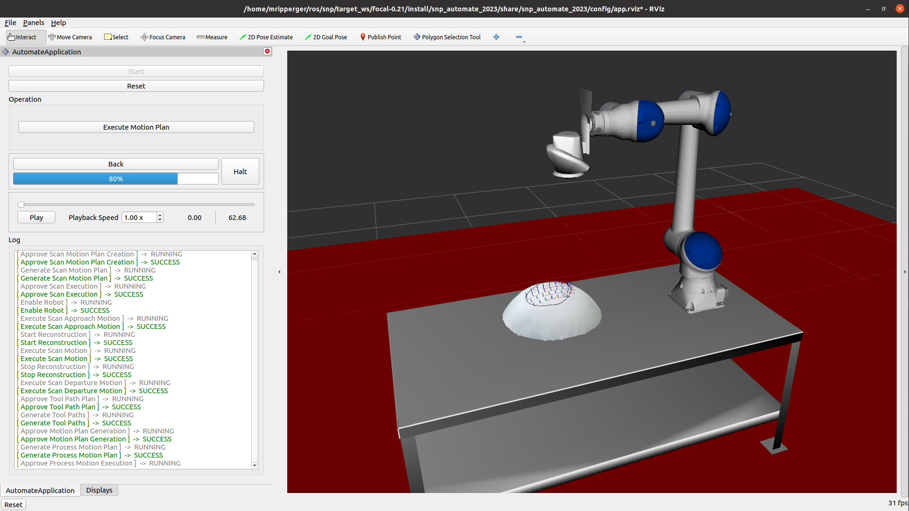

# Scan-N-Plan Workshop

## Description
This repository provides a ROS2-based software framework for performing perception-based surface processing applications.

## Documentation
See the [documentation](https://ros-industrial-consortium/github.io/scan_n_plan_workshop) for more information on the capabilities and usage of this repository.
